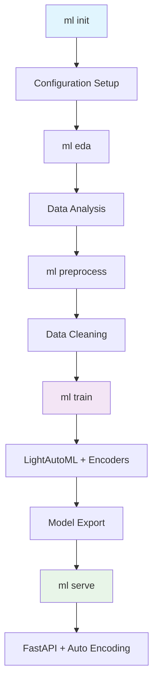

# 🤖 ML CLI Tool (ml-cli-tool)

<div align="center">

[](https://www.python.org/downloads/)
[](LICENSE)
[](https://test.pypi.org/project/ml-cli-tool/)
[](tests/)
[](https://codecov.io/gh/Ayo-Cyber/ml_cli)
[](https://github.com/psf/black)

**A comprehensive command-line interface for end-to-end machine learning workflows**

> 📦 **Package name**: `ml-cli-tool` (install via `pip install ml-cli-tool`)  
> 🔧 **CLI command**: `ml` (after installation)

[Quick Start](#-quick-start) • [Documentation](#-documentation) • [Examples](#-examples) • [Contributing](#-contributing)

</div>

## 🚀 Overview

**ML CLI Tool** is a powerful, user-friendly command-line tool that streamlines the entire machine learning workflow. From data exploration to model deployment, it provides a unified interface for data scientists and ML engineers to build, train, and serve machine learning models with minimal setup.

Built with modern Python technologies including **FastAPI**, **LightAutoML**, and **Click**, this tool eliminates the repetitive scripting often required in ML projects and provides production-ready model serving capabilities with intelligent categorical encoding.

### ✨ Why ML CLI Pipeline?

- **🎯 Zero Configuration**: Get started with a single command - no complex setup files
- **🔄 End-to-End Workflow**: Complete ML pipeline from EDA to production deployment
- **🤖 AutoML Integration**: Leverage LightAutoML for fast, efficient model selection
- **🚀 Production Ready**: Built-in FastAPI server with auto-generated documentation
- **🔤 Smart Encoding**: Automatic categorical feature encoding with human-readable API
- **📊 Rich Visualizations**: Automated EDA reports with beautiful plots and statistics
- **🔧 Flexible Configuration**: Support for both YAML and JSON configuration formats
- **🧪 Thoroughly Tested**: Comprehensive test suite ensuring reliability

## ✨ Features

<table>
<tr>
<td width="50%">

### 🛠️ **Core Capabilities**
- **Interactive Project Setup** - Guided initialization with intelligent defaults
- **Automated EDA** - Comprehensive data analysis with visualizations
- **Smart Preprocessing** - Automatic categorical encoding and data cleaning
- **AutoML Training** - LightAutoML-powered model optimization
- **Categorical Encoding** - Automatic encoding with human-readable API inputs
- **Flexible Prediction** - Easy inference on new data
- **Production Serving** - FastAPI-based REST API deployment

</td>
<td width="50%">

### 🎯 **Advanced Features**
- **Dynamic API Documentation** - Auto-generated examples from your data
- **Model Reloading** - Hot-reload models without server restart
- **Artifact Tracking** - Automatic cleanup of generated files
- **Multi-format Support** - CSV, JSON, and remote URL data sources
- **SSL Support** - Secure data fetching from HTTPS sources
- **Rich CLI Interface** - Beautiful terminal output with progress bars

</td>
</tr>
</table>

## 🛠️ Installation

### Prerequisites
- Python 3.12 or higher (Python 3.10+ supported)
- pip (Python package installer)

### Quick Install (from TestPyPI)

```bash
# Install from TestPyPI
pip install --index-url https://test.pypi.org/simple/ --extra-index-url https://pypi.org/simple/ ml-cli-tool

# Verify installation
ml --help
```

### Install from Source

```bash
# Clone the repository
git clone https://github.com/Ayo-Cyber/ml_cli.git
cd ml_cli

# Create virtual environment (recommended)
python -m venv venv
source venv/bin/activate  # On Windows: venv\Scripts\activate

# Install in development mode
pip install -e .
```

### Verify Installation

```bash
ml --help
```

You should see the ML CLI help menu with all available commands.

## 🚀 Quick Start

Get up and running in under 5 minutes:

### 1. Initialize Your Project

```bash
ml init
```

This interactive command will:
- Guide you through project setup
- Validate your data file
- Create optimized configuration
- Set up your workspace

### 2. Explore Your Data

```bash
ml eda
```

Generates comprehensive analysis including:
- 📊 Summary statistics (`summary_statistics.csv`)
- 📈 Missing value reports (`eda_report.csv`)
- 🔥 Correlation heatmaps (`correlation_matrix.png`)

### 3. Preprocess Your Data

```bash
ml preprocess
```

Automatically handles:
- One-hot encoding for categorical variables
- Data validation and cleaning
- Feature preparation for training

### 4. Train Your Model

```bash
ml train
```

Leverages LightAutoML to:
- Automatically detect and encode categorical features
- Find optimal algorithms efficiently
- Tune hyperparameters with intelligent search
- Export production-ready models with encoders
- Generate performance metrics

### 5. Serve Your Model

```bash
ml serve
```

Instantly deploy your model with:
- 🌐 RESTful API endpoints
- 📚 Interactive Swagger UI documentation at `/docs`
- 🔄 Hot-reload capabilities
- 📝 Auto-generated examples with categorical values
- 🔤 Automatic categorical encoding (send "Male" instead of 0)
- ✅ Input validation with helpful error messages

## 📖 Documentation

### Command Reference

<details>
<summary><b>🔧 ml init</b> - Initialize new ML project</summary>

```bash
ml init [OPTIONS]
```

**Options:**
- `--format [yaml|json]` - Configuration format (default: yaml)
- `--ssl-verify/--no-ssl-verify` - SSL verification for URLs (default: enabled)

**Features:**
- Interactive project setup wizard
- Data validation and target column detection
- Intelligent default suggestions
- Support for local files and URLs

</details>

<details>
<summary><b>📊 ml eda</b> - Exploratory Data Analysis</summary>

```bash
ml eda
```

**Generates:**
- Summary statistics for all features
- Missing value analysis
- Data type information
- Correlation matrix visualization

**Output Files:**
- `summary_statistics.csv`
- `eda_report.csv` 
- `correlation_matrix.png`

</details>

<details>
<summary><b>🧹 ml preprocess</b> - Data Preprocessing</summary>

```bash
ml preprocess [OPTIONS]
```

**Options:**
- `--config, -c PATH` - Configuration file path (default: config.yaml)

**Features:**
- Automatic categorical variable encoding
- Data validation and cleaning
- Preprocessed data export

</details>

<details>
<summary><b>🤖 ml train</b> - Model Training</summary>

```bash
ml train [OPTIONS]
```

**Options:**
- `--config, -c PATH` - Configuration file path (default: config.yaml)

**LightAutoML Configuration (in config.yaml):**
```yaml
lightautoml:
  timeout: 300           # Training timeout in seconds
  cpu_limit: 4          # Number of CPU cores to use
  gpu_ids: null         # GPU IDs (e.g., "0,1" or null for CPU only)
```

**Performance Tips:**
- For **quick testing**: `timeout: 60` (1 minute)
- For **balanced training**: `timeout: 300` (5 minutes, default)
- For **production**: `timeout: 600-1800` (10-30 minutes)
- **CPU cores**: Set `cpu_limit` to your available cores (default: 4)
- **GPU acceleration**: Set `gpu_ids: "0"` if you have a compatible GPU

**Outputs:**
- `lightautoml_model.pkl` - Trained LightAutoML model
- `encoders.pkl` - Categorical feature encoders (if categorical data detected)
- `feature_encodings.json` - Human-readable categorical value mappings
- `feature_info.json` - Model metadata and statistics

**Categorical Feature Handling:**
- **Automatic Detection**: Detects categorical columns (object/category dtype)
- **Smart Encoding**: Creates LabelEncoder for each categorical feature
- **Human-Readable API**: API accepts original values ("Male", "Premium")
- **Validation**: API rejects unknown categorical values with helpful errors

</details>

<details>
<summary><b>🔮 ml predict</b> - Make Predictions</summary>

```bash
ml predict -i INPUT_FILE -o OUTPUT_FILE -m MODEL_DIR
```

**Required Options:**
- `-i, --input-path PATH` - Input CSV file
- `-o, --output-path PATH` - Output predictions file
- `-m, --model-path PATH` - Model directory

</details>

<details>
<summary><b>🚀 ml serve</b> - Model Serving</summary>

```bash
ml serve [OPTIONS]
```

**Options:**
- `--host TEXT` - Host address (default: 127.0.0.1)
- `--port INTEGER` - Port number (default: 8000)
- `--reload/--no-reload` - Auto-reload on changes (default: True)
- `--config, -c PATH` - Configuration file (default: config.yaml)

**API Endpoints:**
- `GET /` - API information
- `GET /health` - Health check
- `GET /model-info` - Model metadata and categorical encodings
- `POST /predict` - Make predictions (single sample)
- `POST /predict-batch` - Batch predictions
- `POST /reload-model` - Reload model after retraining
- `GET /docs` - Interactive Swagger UI documentation
- `GET /redoc` - Alternative ReDoc documentation

**Categorical Features in API:**
```bash
# API automatically accepts human-readable categorical values
curl -X POST "http://localhost:8000/predict" \
     -H "Content-Type: application/json" \
     -d '{
       "Gender": "Male",
       "Subscription Type": "Premium",
       "Contract Length": "Monthly",
       "Age": 45,
       "Tenure": 12
     }'
```

**Response includes predictions and probabilities:**
```json
{
  "prediction": 1,
  "probabilities": [0.324, 0.676],
  "confidence": 0.676
}
```

</details>

<details>
<summary><b>🧹 ml clean</b> - Cleanup Artifacts</summary>

```bash
ml clean
```

Removes all generated files tracked in `.artifacts.log`

</details>

### Configuration Format

The [`ml init`](ml_cli/commands/init.py) command creates a configuration file with the following structure:

```yaml
# config.yaml
data:
  data_path: 'data/your_dataset.csv'
  target_column: 'target'

task:
  type: 'classification'  # or 'regression'

output_dir: 'output'

lightautoml:
  timeout: 300         # Training timeout in seconds (5 minutes)
  cpu_limit: 4        # Number of CPU cores
  gpu_ids: null       # GPU IDs (e.g., "0,1") or null for CPU

training:
  test_size: 0.2
  random_state: 42
```

## 💡 Examples

### Complete Workflow Example

```bash
# 1. Set up project
ml init
# Follow prompts to configure your project

# 2. Analyze your data
ml eda

# 3. Prepare data for training
ml preprocess

# 4. Train your model
ml train

# 5. Start API server
ml serve --port 8080

# 6. Test your API (with categorical features)
curl -X POST "http://localhost:8080/predict" \
     -H "Content-Type: application/json" \
     -d '{
       "Gender": "Male",
       "Age": 45,
       "Subscription Type": "Premium"
     }'
```

### Categorical Feature Example

```bash
# Train a model with categorical data
ml train

# The tool automatically detects categorical columns
# Output shows: "✅ Created encoders for 3 categorical features"

# Start the API server
ml serve

# API accepts human-readable categorical values
curl -X POST "http://localhost:8000/predict" \
     -H "Content-Type: application/json" \
     -d '{
       "Gender": "Male",           # Not 0 or 1!
       "Subscription Type": "Premium",
       "Contract Length": "Monthly"
     }'

# Response includes predictions and probabilities
# {
#   "prediction": 1,
#   "probabilities": [0.324, 0.676],
#   "confidence": 0.676
# }
```

### Working with Remote Data

```bash
# Initialize with remote dataset
ml init
# Enter URL: https://example.com/dataset.csv

# The tool automatically downloads and validates the data
```

### Custom Configuration

```bash
# Use JSON configuration
ml init --format json

# Train with custom config
ml train --config my_config.yaml

# Serve with custom host/port
ml serve --host 0.0.0.0 --port 9000
```

## 🏗️ Architecture

<div align="center">



</div>

### Project Structure

```
ml_cli/
├── 📁 ml_cli/
│   ├── 🌐 api/              # FastAPI application
│   │   └── main.py          # API endpoints and model serving
│   ├── ⚡ commands/         # CLI command implementations
│   │   ├── init.py          # Project initialization
│   │   ├── eda.py           # Exploratory data analysis
│   │   ├── train.py         # Model training
│   │   ├── serve.py         # Model serving
│   │   └── ...
│   ├── 🧠 core/            # Core ML logic
│   │   ├── data.py          # Data loading and validation
│   │   └── train.py         # Training algorithms
│   ├── 🛠️ utils/           # Utility functions
│   │   └── utils.py         # Helper functions
│   └── 🚀 cli.py           # Main CLI entry point
├── 🧪 tests/               # Comprehensive test suite
├── 📊 examples/            # Example datasets
├── 📋 requirements.txt     # Dependencies
└── ⚙️ setup.py            # Package configuration
```

## 🧪 Testing

Run the comprehensive test suite:

```bash
# Run all tests
python -m pytest

# Run with coverage
python -m pytest --cov=ml_cli

# Run specific test file
python -m pytest tests/test_cli.py -v
```

### Test the API

Use the included [test script](test_api.py):

```bash
# Start the server
ml serve

# Run API tests (in another terminal)
python test_api.py
```

## 🤝 Contributing

We welcome contributions! Here's how to get started:

### Development Setup

```bash
# Fork and clone the repository
git clone https://github.com/YOUR_USERNAME/ml_cli.git
cd ml_cli

# Create development environment
python -m venv venv
source venv/bin/activate

# Install in development mode with test dependencies
pip install -e .
pip install pytest pytest-cov black flake8

# Run tests to ensure everything works
pytest
```

### Contributing Guidelines

1. **🍴 Fork** the repository
2. **🌿 Create** a feature branch (`git checkout -b feature/amazing-feature`)
3. **✅ Test** your changes (`pytest`)
4. **💫 Format** your code (`black ml_cli/`)
5. **📝 Commit** your changes (`git commit -m 'feat: Add amazing feature'`)
6. **🚀 Push** to the branch (`git push origin feature/amazing-feature`)
7. **📬 Open** a Pull Request

### Code Standards

- Follow [PEP 8](https://pep8.org/) style guidelines
- Use [Black](https://github.com/psf/black) for code formatting
- Write comprehensive tests for new features
- Update documentation for user-facing changes

## 📈 Roadmap

### Upcoming Features

- [ ] 🐳 **Docker Support** - Containerized deployment
- [ ] ☁️ **Cloud Integration** - AWS/GCP/Azure deployment
- [ ] 📱 **Web UI** - Browser-based interface
- [ ] 🔄 **Model Versioning** - Track model iterations
- [ ] 📊 **Advanced Metrics** - Detailed performance analytics
- [ ] 🛡️ **Model Monitoring** - Production model tracking
- [ ] 🔌 **Plugin System** - Custom algorithm integration

### Performance Improvements

- [ ] ⚡ **Parallel Processing** - Multi-core training
- [ ] 💾 **Caching** - Intelligent result caching
- [ ] 📦 **Model Compression** - Optimized model sizes

## 📄 License

This project is licensed under the **MIT License** - see the [LICENSE](LICENSE) file for details.

## 🆘 Support

### Getting Help

- 📚 **Documentation**: Check this README and inline help (`ml --help`)
- 🐛 **Bug Reports**: [Open an issue](https://github.com/Ayo-Cyber/ml_cli/issues)
- 💡 **Feature Requests**: [Start a discussion](https://github.com/Ayo-Cyber/ml_cli/discussions)
- 📧 **Direct Contact**: atunraseayomide@gmail.com

### FAQ

<details>
<summary><b>Q: What data formats are supported?</b></summary>

A: Currently supports CSV, TXT, and JSON files. Both local files and remote URLs (HTTP/HTTPS) are supported.
</details>

<details>
<summary><b>Q: Can I use custom machine learning algorithms?</b></summary>

A: Currently, the tool uses LightAutoML for AutoML. LightAutoML automatically selects from a variety of algorithms including gradient boosting, neural networks, and linear models. Custom algorithms will be supported in future versions through a plugin system.
</details>

<details>
<summary><b>Q: How are categorical features handled?</b></summary>

A: Categorical features are automatically detected during training and encoded using LabelEncoders. The API accepts human-readable categorical values (like "Male", "Premium") and automatically encodes them. Unknown values are rejected with helpful error messages listing valid options.
</details>

<details>
<summary><b>Q: What's the difference between LightAutoML and TPOT?</b></summary>

A: We migrated from TPOT to LightAutoML in v0.2.0 for better Python 3.12+ support, faster training times, and improved handling of categorical features. LightAutoML uses timeout-based training instead of generations, making it more predictable and efficient.
</details>

<details>
<summary><b>Q: How do I deploy models to production?</b></summary>

A: Use `ml serve` to create a production-ready FastAPI server. For advanced deployment, consider using Docker or cloud platforms.
</details>

<details>
<summary><b>Q: Is GPU training supported?</b></summary>

A: Yes! LightAutoML supports GPU acceleration. Set `gpu_ids: "0"` in your config.yaml to enable GPU training. Make sure you have PyTorch with CUDA support installed.
</details>

## 🔄 Migration Guide

### Upgrading from v0.1.x (TPOT) to v0.2.x (LightAutoML)

If you have projects using the old TPOT-based version, here's how to migrate:

**1. Update Configuration File:**

Old (TPOT):
```yaml
tpot:
  generations: 4
  population_size: 20
  max_time_mins: 5
  cv_folds: 3
  n_jobs: 1
```

New (LightAutoML):
```yaml
lightautoml:
  timeout: 300       # 5 minutes (max_time_mins * 60)
  cpu_limit: 4       # Use available cores
  gpu_ids: null      # null for CPU, "0" for GPU
```

**2. Update Python Version:**
- Old: Python 3.10+
- New: Python 3.12+ (though 3.10+ still works)

**3. Retrain Models:**
```bash
# Old models (fitted_pipeline.pkl) won't work with new version
# Retrain with LightAutoML:
ml train
```

**4. New Model Files:**
- Old: `fitted_pipeline.pkl`, `best_model_pipeline.py`
- New: `lightautoml_model.pkl`, `encoders.pkl`, `feature_encodings.json`

**5. API Changes:**
- ✅ Categorical features now accepted as strings (automatic encoding)
- ✅ Responses include probabilities and confidence scores
- ✅ Better error messages with valid value suggestions

**Benefits of Migration:**
- ⚡ **Faster Training**: 2-3x speed improvement
- 🐍 **Python 3.12 Support**: Latest Python features
- 🔤 **Better UX**: Human-readable categorical inputs
- 🎯 **Predictable Runtime**: Timeout-based instead of generation-based

</details>

---

<div align="center">

**⭐ Star this repo if you find it helpful!**

Made with ❤️ by [Atunrase Ayomide](https://github.com/Ayo-Cyber)

[🏠 Home](https://github.com/Ayo-Cyber/ml_cli) • [📖 Docs](#-documentation) • [🐛 Issues](https://github.com/Ayo-Cyber/ml_cli/issues) • [💬 Discussions](https://github.com/Ayo-Cyber/ml_cli/discussions)

</div>